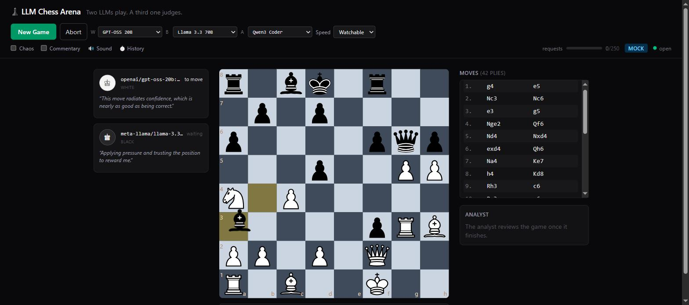

# ♟ LLM Chess Arena

Two LLMs play chess against each other through OpenRouter. A third LLM watches
the finished game, grades both players, and delivers a verdict. Everything
streams live to a browser over one WebSocket.



The chess engine (`python-chess`) is always the source of truth — the models only
*propose* moves. Illegal proposals get retried, then overridden with a random
legal move, and the Analyst gets to mock the model for it.

See [PLAN.md](PLAN.md) for the full design and [PROGRESS.md](PROGRESS.md) for
build status.

## Quick start (Docker)

The fastest way to watch a match — no Python, no Node, no API key:

```bash
docker compose up --build
```

Then open **http://localhost:8080** and click **New Game**. It runs in **mock
mode** by default: two agents play with random legal moves and canned
commentary, a third produces a verdict — all with **zero API calls**.

To play with real models, put an OpenRouter key in a `.env` file next to
`docker-compose.yml` and switch to live:

```bash
# .env
OPENROUTER_API_KEY=sk-or-v1-...
MODE=live
```

then `docker compose up`. Read the quota guidance below first — the free tier is
tight, so keep games short. The game database persists in a named volume across
restarts; the History panel lists past games.

Stop it with `docker compose down` (add `-v` to also wipe the game database).

> Built and verified end-to-end (Docker 29, Compose v2): both images build, the
> backend healthcheck passes, and a live game streams over the nginx-proxied
> WebSocket at http://localhost:8080. If a build hiccups on your machine, the
> manual setup below always works.

## Requirements (manual setup)

- Python 3.11+ (built and tested on 3.13)
- Node 20+ (built and tested on 24)
- Docker + Compose (only for the Quick start above)

## Setup

```bash
# Backend
cd backend
python -m venv .venv
./.venv/Scripts/python.exe -m pip install -r requirements.txt   # Windows
# source .venv/bin/activate && pip install -r requirements.txt  # macOS/Linux

# Frontend
cd ../frontend
npm install
```

## Running

Two terminals:

```bash
# Terminal 1 — backend on :8000
cd backend && ./.venv/Scripts/python.exe -m uvicorn app.main:app --reload

# Terminal 2 — frontend on :5173 (Vite proxies /api and /ws to the backend)
cd frontend && npm run dev
```

Open the URL Vite prints. `GET /health` on the backend reports mode, models, and
whether a key is configured.

## Mock vs live

`config.yaml` sets `mode`. **`mock` is the default and needs no API key** — games
run with random legal moves and canned commentary, costing zero requests. Build
and test everything here.

`live` calls real OpenRouter models and requires `OPENROUTER_API_KEY` in `.env`
(copy `.env.example`). Starting in live mode without a key fails loudly rather
than 401-ing on every move. `MODE=live` in the environment overrides
`config.yaml` for a one-off run.

## Getting an OpenRouter key

Sign up at [openrouter.ai](https://openrouter.ai), create a key at
`openrouter.ai/keys`, and put it in `.env`. `.env` is gitignored; the key stays
backend-only and never reaches the frontend.

## Quota guidance

The free tier is roughly **20 requests/min and 50/day** (1,000/day once an
account has ever purchased $10 in credits). **One full game is ~60–120
requests**, so the 50/day tier cannot finish a standard game — lower
`game.max_moves` to ~30 for a live smoke test, or add credits.

Guard rails already in config: a 4s minimum gap between requests (~15/min, under
the cap), and `throttle.max_requests_per_game` as a hard kill-switch.

Free model IDs rotate. Run `python scripts/verify_models.py` before a live run to
confirm the configured `:free` IDs still exist; `openrouter/free` is the
always-works fallback.
