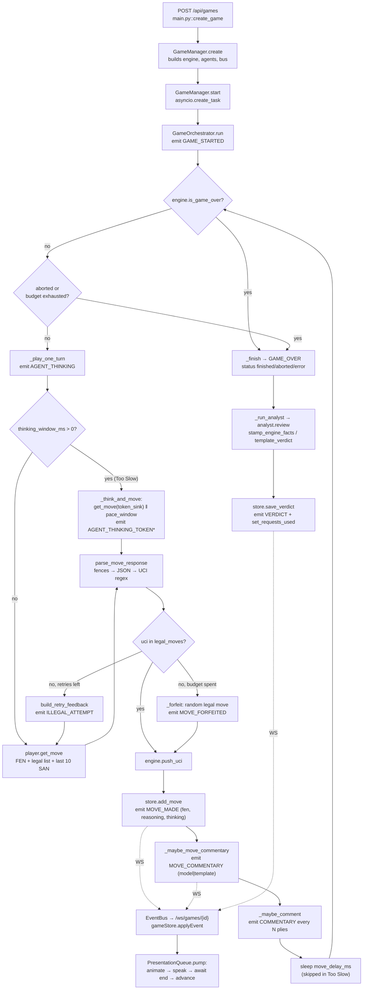

# PROJECT_OVERVIEW_REVISED.md — LLM Chess Arena

End-to-end review of the codebase as it actually stands, reconciled against
`PLAN.md` and `PROGRESS.md`. Written from a read of every source file on branch
`docs/codebase-review`; no code was changed. Where the docs and the code
disagree, the code wins and the disagreement is flagged in §9.

> **Revision note (2026-08-07).** This is a revised copy of
> `docs/PROJECT_OVERVIEW.md`; the original is left untouched. Three corrections
> were applied after an actual live-mode run against OpenRouter on branch
> `fix/live-illegal-moves`, which produced evidence the original could not have
> had:
>
> 1. **§6, §8 — the rate limit is a *daily* cap, not a per-minute one.** The
>    original attributes live failures to a per-minute bucket; the observed 429
>    reports `limit_source: openrouter_free_tier_daily`, `X-RateLimit-Limit: 50`.
> 2. **§8 — the 2026-07-16 per-model "tuning signal" is confounded** by the
>    `max_tokens_move: 300` truncation bug later fixed in `2c9510e`.
> 3. **§9 — added the `usage_daily: 0` diagnostic trap** (new item 16).
>
> Everything else is unchanged from the original, including the §6 config table's
> model names and values, which have since drifted on `fix/live-illegal-moves`
> (see §9 item 3 — deliberately *not* corrected here).

---

## 1. What it is

Two LLMs play a full game of chess against each other through OpenRouter while a
third LLM reviews the finished game and delivers a graded verdict; a fourth agent
narrates each move aloud in the browser. The governing idea is that **the LLM is
never the source of truth** — `python-chess` (`backend/app/engine.py::ChessEngine`)
owns the board, models only *propose* UCI moves chosen from an explicitly supplied
legal-move list, and anything illegal is retried three times then overridden with a
random legal move and recorded as a forfeit. The backend is the single narrator: a
FastAPI process emits one ordered, gap-free event stream over a WebSocket and the
React frontend renders it without computing any chess of its own. Everything runs
end-to-end with **zero API calls** in `mode: mock`, which is the default.

---

## 2. Architecture

Four agent roles, all behind ABCs in `backend/app/agents/base.py` so mock and live
modes are the *same* orchestrator code path:

| Role | Interface | Mock impl | Live impl | Called |
|---|---|---|---|---|
| White player | `BasePlayer.get_move` | `MockPlayer` | `PlayerAgent` | every White ply |
| Black player | `BasePlayer.get_move` | `MockPlayer` | `PlayerAgent` | every Black ply |
| Analyst | `BaseAnalyst.review` / `.comment` | `MockAnalyst` | `AnalystAgent` | after `GAME_OVER`; optional every N plies |
| Commentator | `BaseCommentator.comment_move` | `MockCommentator` | `CommentatorAgent` | after each `MOVE_MADE` (F2) |

Authority is deliberately split. `PlayerAgent` owns the *retry* loop but not the
*forfeit decision* — on budget exhaustion it hands back the model's last bad answer
so `GameOrchestrator._enforce_legality` is the one place that decides to substitute
a move (`backend/app/agents/player.py:258`). The Analyst may name a *performance*
winner but `verdict.stamp_engine_facts()` overwrites the authoritative result
fields afterwards, so a model cannot rewrite who won.

In live mode all three live agents share **one** `OpenRouterClient` and therefore
one global `Throttle` and one per-game request budget — OpenRouter's limits are per
account, not per model (`backend/app/manager.py::GameManager._build_players`).



---

## 3. Backend breakdown

`backend/app/` — 14 modules, ~2,900 lines. Every module has a single owner.

| File | Responsibility |
|---|---|
| `main.py` | FastAPI app. REST surface (`/health`, `POST /api/games`, `GET /api/games[/{id}][/events]`, `POST /api/games/{id}/abort`, `GET /api/models`) plus `WS /ws/games/{id}?since=N`. The WS handler **subscribes to the bus before replaying history**, so events published mid-replay queue instead of vanishing; finished games are served straight from SQLite so a backend restart doesn't break replay (`main.py:164`). |
| `config.py` | `config.yaml` for tunables, `.env` for secrets, `MODE` env overriding `config.yaml`. `load_settings()` raises if `mode: live` with an empty key — fails at load rather than 401-ing on every move. `get_settings()` is `lru_cache`d. |
| `engine.py` | `ChessEngine`: the only authority on state. `push_uci()` validates against the legal-move generator and raises `IllegalMoveError`. Provides `fen`/`turn`/`legal_moves_uci()`/`san_history()`, `outcome` (with `claim_draw=True` so 50-move and threefold actually end games), `termination`, `winner`, `material_balance()`, max-move adjudication at `ADJUDICATION_MARGIN = 2` pawns, `pgn()` and `is_valid_pgn()`. `max_moves` counts **plies**, not full moves. |
| `orchestrator.py` | `GameOrchestrator` — the game loop. `run()` → `_play_one_turn()` → `_enforce_legality()` / `_forfeit()` → `_maybe_move_commentary()` → `_maybe_comment()` → `_finish()` → `_run_analyst()`. `_emit()` publishes **and** persists in one step so the WS and the DB can never disagree. `_think_and_move()` runs the F1 window. |
| `manager.py` | `GameManager` / `GameSession`: owns running games and their asyncio tasks, builds mock vs live agents, wires the client's event hook to publish+persist, closes the httpx pool when a game ends, and `shutdown()`s in-flight games on app teardown. |
| `llm_client.py` | `OpenRouterClient` + `Throttle`. Retry ladder: 429 → 10/30/60s backoff + `RATE_LIMITED` event → `RateLimitError`; 401/403 → `AuthError` with no retry; 404 → swap to `fallback_model` once; 5xx → 2 retries. Empty-content guard (including provider errors returned inside a 200). `complete(..., token_sink=…)` switches to SSE streaming; `sse_delta()` is a pure, testable line assembler and a sink that throws never aborts the stream. `requests_used` counts every request, retries included. |
| `agents/base.py` | `MoveProposal`, `MoveContext`, `CommentaryResult`, `TokenSink`, and the `BasePlayer` / `BaseAnalyst` / `BaseCommentator` ABCs. |
| `agents/player.py` | `MockPlayer` (seedable, with `illegal_rate`/`forfeit_rate` to exercise penalty paths offline) and `PlayerAgent` (retry loop, reasoning-first prompt variant when streaming). |
| `agents/analyst.py` | `MockAnalyst` (template verdict + canned commentary) and `AnalystAgent` (temp 0.3, one parse retry, then template fallback). |
| `agents/commentator.py` | `template_move_commentary()` — pure, engine-fact, broadcaster-flavoured, deterministic per position via `_variant()`/crc32 — plus `MockCommentator` and `CommentatorAgent` (temp 0.8, falls back to the template on any `LLMError` or empty reply, returning the **true** source). |
| `thinking.py` | F1 pacing core, pure timing. `ReasoningBuffer` reassembles streamed chunks into whole words; `release_count()` decides how many to reveal per tick (finished-early spreads the remainder, still-producing trickles); `pace_window()` runs the reveal with injectable clock/sleep. |
| `parsing.py` | The defensive chain: `strip_fences` → `extract_json_object` → `normalise_uci` → bare-UCI-in-prose fallback. Accepts key synonyms (`move`/`uci`/`move_uci`/`best_move`). Knows nothing about positions — it guarantees *shape*, the engine decides *legality*. |
| `prompts.py` | Every template: `PLAYER_SYSTEM` / `PLAYER_SYSTEM_THINKING`, `PLAYER_USER`, `build_retry_feedback`, analyst system/user, live-commentary, and the F2 commentator prompts. |
| `verdict.py` | `GameFacts` (engine/DB-derived evidence with `illegal_attempts()`, `forfeits()`, `annotated_moves()`), the `Verdict` pydantic schema (tolerant `winner` normalisation, list coercion), `grade_for()` (rule-following rates only), `template_verdict()` and `stamp_engine_facts()`. |
| `events.py` | `EventType` (12 values), the `Event` model, and `EventBus` — per-game pub/sub with gap-free `seq`, full history for replay, and eviction of subscribers whose queue fills so a stalled tab can't stall the game loop. |
| `store.py` | `GameStore` over plain `sqlite3` (WAL, FKs, `UNIQUE(game_id, ply)` / `UNIQUE(game_id, seq)`). `get_events()` returns the canonical `data` shape, not the raw `payload` column, so REST and WS are interchangeable. `_migrate()` adds `moves.thinking` to pre-existing DBs. `ARENA_DB_PATH` puts the DB on a Docker volume. |
| `models_catalog.py` | `GET /api/models` backing store: bundled static list offline in mock mode, OpenRouter proxy filtered to free and cached 1h in live mode, bundled list as the live fallback. |

`backend/tests/` — 14 files. `conftest.py` carries an **autouse `block_network` fixture** that makes real HTTP transports and `socket.create_connection` raise, so "no live calls were made" is checkable rather than promised.

---

## 4. Frontend breakdown

Vite + React 19 + TS + Tailwind v4 + zustand. `frontend/src/`:

- **`main.tsx` → `App.tsx`** — the whole app; no router. Game id lives in `?game=` so a refresh rehydrates. Three-column desktop grid collapsing to single-column mobile with the board first (`order-1` on the board section).
- **`api/ws.ts`** — REST client + `streamGame()`. The rule: the WS is a delivery mechanism, never the source of truth. Every (re)connect calls `fetchGame()` first, then follows the socket from that `seq`, with exponential backoff and **no** reconnect on deliberate closes (1000 / 4404).
- **`state/gameStore.ts`** — zustand. `applyEvent()` is idempotent (drops `seq <= lastSeq`) and handles all 12 event types; `hydrate()` rebuilds everything from REST including illegal/forfeit counts recomputed from the event log.
- **`types/events.ts`** — mirrors `backend/app/events.py` field for field.
- **Components** — `Board.tsx` (react-chessboard v5 `options` object, dragging disabled), `MoveList.tsx` (SAN pairs, `⚠` forfeits, `×N` retries, clickable to scrub), `AgentPanel.tsx`, `ThinkingPanel.tsx`, `AnalystPanel.tsx` (caption feed + comment feed + rate-limit banner), `VerdictCard.tsx` (engine result and analyst opinion rendered as *separate* things, with a "template" badge when nothing reviewed it), `PlaybackControls.tsx`, `QuotaMeter.tsx`, `GameHistory.tsx`, `GameControls.tsx`.
- **`hooks/useSounds.ts`** — Web Audio synthesised cues, unlocked lazily on first play; only fires for a *single* new ply so rehydration doesn't burst.

### Streaming and commentary flow

Two distinct streams meet in the UI:

1. **Reasoning tokens (F1).** `AGENT_THINKING` resets that colour's buffer; each `AGENT_THINKING_TOKEN` appends to `store.thinkingText[color]`; `MOVE_MADE` clears the buffer and the full text lands on the move row. `ThinkingPanel` renders it as a typewriter with a blinking cursor. Clicking a past move shows its stored `thinking` instead (`App.tsx::thinkingFor`).

2. **Voice commentary (F2).** When Commentary is on, the board is driven by
   `lib/presentationQueue.ts::PresentationQueue`, **not** by raw `MOVE_MADE`.
   `pump()` consumes items strictly one at a time in ply order: `animate` → wait
   for the ply's commentary (with a 6s timeout so a silent ply can't stall) →
   `onSpeakStart` → `await speak()` → `onAdvance` → `nextPly += 1`. `speak` is
   `lib/tts.ts::TTSService.speak`, which resolves on the utterance's real `end`
   event — never a timer — with a chain that serialises utterances, a guard timer
   for browsers that drop `end`, and a mute that still resolves after a
   caption-reading delay so captions keep pacing. `hooks/usePresentation.ts` wires
   the queue to the store and fast-forwards past history on rehydration so
   reloading doesn't re-speak the game.

   The invariant: **the game loop may run arbitrarily far ahead of presentation;
   the board may never get ahead of the voice.** `presentationQueue.test.ts` pins
   exactly that.

---

## 5. End-to-end game lifecycle

1. **Start.** `App.tsx::handleNewGame` → `api/ws.ts::createGame` → `POST /api/games`
   (`main.py::create_game`) → `GameManager.create` builds the store row, `EventBus`,
   agents and `GameOrchestrator`, then `GameManager.start` launches it as a
   background task. The game id goes into `?game=` and `useEffect` opens the stream.
2. **Connect.** `api/ws.ts::streamGame` → `GET /api/games/{id}`
   (`main.py::get_game` → `store.get_full_game`) → `gameStore.hydrate`, then
   `WS /ws/games/{id}?since=N` (`main.py::game_stream`) replays `bus.history` past
   `since` and follows live.
3. **Turn begins.** `GameOrchestrator._play_one_turn` emits `AGENT_THINKING` with
   colour and model; `gameStore` sets `thinking` and clears that side's buffer.
4. **Move proposed.** Ordinary mode calls `player.get_move(fen, legal_moves,
   move_history_san, move_number, retry_budget)` directly. "Too Slow" mode calls
   `_think_and_move`, which spawns `get_move(token_sink=…)` and runs
   `thinking.pace_window` concurrently, emitting `AGENT_THINKING_TOKEN` per released
   word; `MOVE_MADE` fires only after the window closes.
5. **Validate.** `PlayerAgent.get_move` builds prompts via
   `prompts.build_player_system/_user`, calls `OpenRouterClient.complete`, and parses
   with `parsing.parse_move_response`. Illegal or unparseable → `build_retry_feedback`
   quoting the exact bad answer, loop. Budget spent → returns the last bad answer.
6. **Enforce.** `_enforce_legality` checks membership in the legal list;
   `_forfeit` emits `MOVE_FORFEITED` and substitutes `self._rng.choice(legal)`.
   Each rejected UCI was already emitted as its own `ILLEGAL_ATTEMPT`.
7. **Commit.** `engine.push_uci` → `MoveRecord` → `store.add_move` → emit
   `MOVE_MADE` (`fen`, `reasoning`, `thinking`, `attempts`, `forfeited`, check/
   capture flags, `requests_used`).
8. **Narrate.** `_maybe_move_commentary` builds a `MoveContext` and calls
   `commentator.comment_move`, emitting `MOVE_COMMENTARY {ply, text, source}`.
   Live failures fall back to `template_move_commentary` and are honestly labelled
   `source: "template"`.
9. **Present.** `gameStore.applyEvent` stores the move and caption;
   `usePresentation` feeds both into the queue; the board advances only after
   `TTSService.speak` resolves. `AnalystPanel` highlights the caption whose ply
   equals `presentation.speakingPly`.
10. **End.** Loop exits on `engine.is_game_over`, abort, or budget kill-switch.
    `_finish` writes the game row and emits a terminal `GAME_OVER` for **every**
    ending tagged `status: finished | aborted | error`.
11. **Verdict.** `_run_analyst` → `analyst.review(self._facts())`. A live verdict is
    parsed tolerantly then run through `stamp_engine_facts`; any failure yields
    `template_verdict`. Persisted via `store.save_verdict`, emitted as `VERDICT`,
    then `store.set_requests_used` folds in the analyst's own requests.

---

## 6. Configuration & environment

`config.yaml` (repo root, read by `config.py::load_settings` via `REPO_ROOT`):

| Key | Value | Notes |
|---|---|---|
| `openrouter.white_model` | `openai/gpt-oss-20b:free` | was `gpt-oss-120b:free`; rotated out, caught by preflight |
| `openrouter.black_model` | `meta-llama/llama-3.3-70b-instruct:free` | |
| `openrouter.analyst_model` | `qwen/qwen3-coder:free` | |
| `openrouter.commentator_model` | `qwen/qwen3-coder:free` | F2 voice |
| `openrouter.fallback_model` | `openrouter/free` | auto-router, used on 404 |
| `openrouter.max_tokens_move / _analysis / _commentary` | 300 / 1500 / 120 | |
| `throttle.min_seconds_between_requests` | 4 | ≈15/min. **Note:** this defends against a per-minute cap, but the free tier's binding limit is **50 requests/day** — request spacing cannot help once that is spent. See §8. |
| `throttle.max_requests_per_game` | 250 | hard kill-switch + quota-meter denominator |
| `game.max_moves` | 120 | **plies**, then material adjudication |
| `game.illegal_move_retries` | 3 | then random legal move |
| `game.live_commentary_every_n_moves` | 0 | analyst text feed, off to save quota |
| `game.move_delay_ui_ms` | 800 | skipped in "Too Slow" mode |
| `game.too_slow_window_ms` | 10000 | F1 per-move window |
| `commentary.enabled` / `.every_n_moves` | `true` / 1 | F2 default (but see §9) |
| `mode` | `mock` | `live` is opt-in |

`.env` (never committed; `.env.example` is the template): `OPENROUTER_API_KEY`,
optional `OPENROUTER_SITE_URL` / `OPENROUTER_SITE_NAME` (sent as OpenRouter's
`HTTP-Referer` / `X-Title` attribution headers), optional `MODE` which overrides
`config.yaml`. Also honoured: `ARENA_DB_PATH` (`store.py`).

**Swapping models** three ways, in increasing scope: per game via the
`white_model` / `black_model` / `analyst_model` fields on `POST /api/games` (the UI's
pickers, populated from `GET /api/models`); per run via `config.yaml`; per request
automatically via the 404 → `fallback_model` swap in `OpenRouterClient.complete`.
The commentator model is **only** settable in `config.yaml` — it is not a
`POST /api/games` field. Run `python scripts/verify_models.py` before any live run;
its `is_free()` treats missing or unparseable pricing as **not** free, failing
toward caution.

---

## 7. Local dev & deployment

**Docker (the advertised path).** `docker compose up --build` → http://localhost:8080.
Two services in `docker-compose.yml`: `backend` (FastAPI, `expose: 8000`, not
published to the host, healthchecked via `/health`) and `frontend` (multi-stage
node:22-alpine build → nginx:alpine). Both build with the **repo root** as context
because `config.py::REPO_ROOT` resolves `parents[2]`, so `config.yaml` must land at
`/app/config.yaml`. `frontend/nginx.conf` serves the SPA and proxies `/api/`
(300s read timeout for rate-limit backoffs) and `/ws/` (3600s, with the
`Upgrade`/`Connection` handshake) to `backend:8000` — same origin, so no CORS. The
DB persists on the `arena-data` named volume via `ARENA_DB_PATH=/app/data/arena.db`.
`.dockerignore` keeps `.env`, venvs, `node_modules` and `*.db` out of the images.
`frontend/Dockerfile` deliberately uses `npm install`, not `npm ci`: the lockfile is
generated on Windows and Vite 8's Rolldown ships platform-specific native bindings.

**Manual.** Backend `uvicorn app.main:app` on :8000, frontend `npm run dev` on :5173
with `vite.config.ts` proxying `/api` and `/ws` to `127.0.0.1:8000`. Note
`PROGRESS.md`'s warning that `uvicorn --reload` does not work reliably on the
original OneDrive-synced checkout — restart manually after backend edits.

**Windows launchers.** `run-local.bat` (mock) and `run-local-live.bat` (`set MODE=live`)
each open two `cmd /k` windows and invoke `backend\.venv\Scripts\python.exe`. They are
Windows-only and assume a Windows venv layout; on this Linux checkout the venv is
`backend/.venv/bin/python` (Python 3.12), so neither script runs here.

**Scripts.** `scripts/run_mock_game.py` (full mock game to stdout, zero calls),
`scripts/verify_models.py` (preflight, one read-only `/models` call),
`scripts/run_live_game.py` (one small live game, scoping `MODE=live` in the script's
own env so `config.yaml` stays `mock`).

---

## 8. Current status & roadmap

**Phases 0–5 are complete.** Per `PROGRESS.md`, with the Definition of Done (§13)
fully ticked including `docker compose up` built and verified end-to-end.

- **Phase 3 (OpenRouter)** — live-verified 2026-07-16. That run was richer than a
  clean game: it exercised the 429 ladder (48 `RATE_LIMITED` events), illegal-move
  retries, forfeit handoff, the request counter, and model-rotation fallback all at
  once. Per-model numbers captured: `gpt-oss-20b:free` proposed 27 illegal
  moves and forfeited 13 of 15 turns; `llama-3.3-70b:free` made 0 illegal moves but
  forfeited all 15.

  > **Correction (2026-08-07): do not read those numbers as a per-model tuning
  > signal — both are confounded.**
  >
  > That run predates commit `2c9510e`, which found that `max_tokens_move: 300`
  > truncated reasoning models mid-thought (`finish_reason="length"`) *before* they
  > emitted the JSON move. `gpt-oss-20b` returned `content=None` and nemotron
  > returned truncated prose; both surfaced downstream as bogus "illegal moves"
  > and forfeits. So `gpt-oss-20b`'s 27 illegal moves are most likely the token
  > budget, not the model's chess. The setting is now `1000`.
  >
  > `llama-3.3-70b`'s 15/15 forfeits are a *different* failure with an identical
  > appearance: rate-limit exhaustion. When the 429 ladder is spent,
  > `OpenRouterClient` raises `RateLimitError`, `PlayerAgent` catches it as
  > `LLMError` (`player.py:231-241`) and returns `NO_MOVE`, and the orchestrator
  > plays a random legal move with the reasoning
  > `"(model unreachable — random move played)"`. This was reproduced exactly on
  > 2026-08-07 (see below).
  >
  > **Neither failure mode is visible as itself in the move list** — both look
  > like a model playing badly. Check the backend log and the move's `reasoning`
  > string before drawing any conclusion about a model's strength.

- **Phase 4 (analyst)** — mock-verified; the *fallback* is live-verified. A
  model-authored verdict has still never been obtained: the account's **daily**
  free-model limit 429s the analyst call that follows a ~100-request game. (The
  original text said "per-minute"; corrected 2026-08-07 — a 100-request game
  exhausts a 50/day allowance twice over, so the analyst call at the end of it
  has no budget left regardless of pacing.)

- **Live run 2026-08-07 (`fix/live-illegal-moves`)** — attempted a deliberately
  small game (`max_moves: 10`, commentary off, thinking window on) and obtained
  **zero model-authored moves**. Every request 429'd from the first call. The
  429 body was explicit:

  ```
  Rate limit exceeded: free-models-per-day.
  X-RateLimit-Limit: 50   X-RateLimit-Remaining: 0
  limit_source: openrouter_free_tier_daily
  remedy_hint: Wait for the daily reset (see X-RateLimit-Reset),
               or purchase credits to raise your free-model daily limit.
  ```

  Both committed moves read `(model unreachable — random move played)`. The
  degradation path behaved correctly — it simply had nothing to degrade from.
  `verify_models.py` passed on all five models immediately beforehand, so model
  availability and quota are independent checks: **a green preflight does not
  mean you can afford to run.**
- **Post-Phase-5 features** — F1 "Too Slow" streaming reasoning and F2 synced voice
  commentary, both mock-verified in-browser and live-verified for plumbing plus
  fallbacks (2026-07-18). The live run proved the real `stream: true` SSE path end
  to end and proved the commentator never goes silent — every commentator call was
  429'd and every move still got a template line. It also found and fixed a real
  bug: `MOVE_COMMENTARY.source` claimed `"model"` for rate-limited template
  fallbacks; `comment_move` now returns a `CommentaryResult` reporting the true
  source per line.

**Roadmap** — everything remaining is Phase 6 stretch (`PLAN.md` §11) plus one
tier-limited item:

- Stockfish eval bar — would give real blunder detection and centipawn data,
  filling `Verdict.blunders` / `best_move`, which `template_verdict` deliberately
  leaves empty rather than inventing.
- Tournament / round-robin mode with a leaderboard.
- PGN download, shareable replay URL, per-model personality prompts.
- Land a model-authored commentator line and verdict — this is a quota
  constraint, not a code gap. **Corrected 2026-08-07:** the original said this
  needed "a refilled per-minute bucket", which is not a thing that happens. The
  free tier allows **50 free-model requests per day**, resetting at **00:00 UTC**;
  there is no intra-day bucket to wait out. The two real remedies are the ones
  OpenRouter itself names: wait for the daily reset, or add $10 of credits to
  raise the ceiling to 1000/day. At 50/day a full 120-ply game (60–120 requests)
  is not affordable at all, and even a 10-ply smoke test costs ~12 — so live mode
  is a demo, not a development loop, until the tier is raised.

---

## 9. Gaps, risks & open questions

### Doc/code mismatches found

1. **`backend/docs/` does not exist.** The repo has exactly four Markdown files:
   `PLAN.md`, `PROGRESS.md`, `README.md`, `frontend/README.md`. `docs/` contains only
   `screenshot.jpg`. This overview is the first file in `docs/`.
2. **`frontend/README.md` is untouched Vite boilerplate** — "React + TypeScript +
   Vite" template text about Oxlint config. It documents nothing about this project
   and is misleading as the frontend's entry-point doc.
3. **`PLAN.md` §4's file tree is stale.** Six shipped backend modules are absent from
   it (`manager.py`, `parsing.py`, `verdict.py`, `thinking.py`, `models_catalog.py`,
   `agents/commentator.py`), as are seven frontend files (`lib/presentationQueue.ts`,
   `lib/tts.ts`, `hooks/usePresentation.ts`, `hooks/useSounds.ts`,
   `components/ThinkingPanel.tsx`, `GameHistory.tsx`, `PlaybackControls.tsx`,
   `QuotaMeter.tsx`). Conversely `components/EvalBar.tsx` is listed but never built
   (correctly — it's a Phase 6 item). §4 lists 4 test files; there are 14.
4. **`PLAN.md` §5 shows `mode: live`**; `config.yaml` ships `mock`. Deliberate and
   documented in `PROGRESS.md`, but §5 was never corrected.
5. **Test count drift.** `PROGRESS.md` claims **368 passed**; the suite actually runs
   **369 passed** (verified this session: `pytest -q`, 9.6s, network blocked). One
   test was added after the last log entry, or the count was recorded slightly off.
6. **`PROGRESS.md` and the git log disagree on dates.** The final feature entry is
   logged 2026-07-18 but the commit landed 2026-07-21 (`22a490d`). Minor, but the
   log is the stated source of truth for status.
7. **Stale in-code comments.** `manager.py`'s module docstring says "Live agents land
   in Phase 3; today every session is mock" — live agents have been built since
   Phase 3. `MoveList.tsx`'s docstring says "Clickable scrubbing lands in Phase 5" —
   it is implemented in that same file. `gameStore.ts` says chess.js "is only for the
   history scrubber in Phase 5"; the scrubber replays stored FENs and **chess.js is
   imported nowhere** (verified by grep) — it is an unused dependency.
8. **`README.md`'s setup path is Windows-first** (`./.venv/Scripts/python.exe`, with
   the macOS/Linux line commented out) and claims Python 3.13, while this checkout's
   venv is Linux Python 3.12. The Dockerfile does use `python:3.13-slim`.

### Behavioural gaps in the code

9. **The analyst's live commentary feed is unreachable from the UI.**
   `App.tsx:170` hardcodes `commentaryEveryNMoves: 0` on every game, so
   `COMMENTARY` events never fire and `AnalystPanel`'s `comments` feed is always
   empty. Only F2 captions render. The backend path and the config key
   (`game.live_commentary_every_n_moves`) work — nothing exposes them.
10. **`commentary.enabled` in `config.yaml` is effectively dead for UI-started
    games.** `/health` returns it, but `App.tsx` never reads it and always sends an
    explicit `move_commentary_enabled` from a toggle that defaults to `false`. So the
    config's `enabled: true` only applies to games created by API clients that omit
    the field. Similarly `commentary.every_n_moves` is never sent by the frontend
    (`NewGameOptions` in `api/ws.ts` has no field for it).
11. **Negative board animation duration in "Too Slow" mode.** `TOO_SLOW_MS = -1` is a
    sentinel, but `App.tsx:336` passes `animationMs={Math.min(speedMs / 2, 300)}`,
    which evaluates to `-0.5` and is handed to react-chessboard's
    `animationDurationInMs`. Cosmetic, and it only affects the one speed setting, but
    it is an unintended value.
12. **Abort latency is one full move.** `_abort` is only checked at the top of the
    loop, so aborting during a 10s "Too Slow" window waits for that window to close;
    `manager.abort` gives it a 10s `asyncio.wait` timeout. Correct by design, but the
    UI's "Aborting…" state can sit visibly for seconds.
13. **`GameStore` uses one `sqlite3` connection with `check_same_thread=False`** and
    commits on every write. Fine at this scale (a few hundred sub-ms writes per game)
    and explicitly reasoned about in the module docstring, but it is a single
    serialisation point if concurrent games are ever run in earnest.
14. **`install.cmd` at the repo root is not part of this project** — it is an
    unrelated Claude Code Windows bootstrap script, currently untracked. It should
    probably be deleted or gitignored before it gets committed by accident.
15. **Uncommitted working-tree changes** predate this review: `frontend/vite.config.ts`
    gains `allowedHosts: ['.app.github.dev']` (a Codespaces affordance) and
    `frontend/package-lock.json` has drifted. Neither is committed on this branch.
16. **`GET /api/v1/auth/key` cannot tell you whether you are out of quota** (added
    2026-08-07). It reports `usage`, `usage_daily`, `usage_weekly` and
    `usage_monthly` in **dollars**, and `:free` models cost $0 — so a fully
    exhausted free-tier key still returns `usage_daily: 0`, alongside
    `limit: null` and `limit_remaining: null`. The `rate_limit` object it returns
    is self-described as *"deprecated and safe to ignore"*. The only honest signal
    is the `X-RateLimit-Remaining` / `X-RateLimit-Limit` header pair on a real
    completion call, or the `metadata.headers` block inside a 429 body. Anyone
    debugging a live run will otherwise read `usage_daily: 0`, conclude the quota
    is untouched, and look for the bug in the wrong place. Worth a note in
    `scripts/verify_models.py`, which today validates model availability but not
    remaining budget — the two failed independently on 2026-08-07 (all five models
    green, zero requests affordable).

### Open questions

- Is the always-`0` analyst commentary in `App.tsx` intentional quota protection, or
  an oversight left over from merging the Voice and Commentary toggles? If
  intentional, `game.live_commentary_every_n_moves` and the `comments` feed are dead
  code worth removing; if not, it wants a control.
- Should `commentator_model` be selectable per game like the other three, given the
  UI already has three pickers?
- Is `chess.js` worth keeping as a dependency now that the scrubber replays stored
  FENs and nothing imports it?
